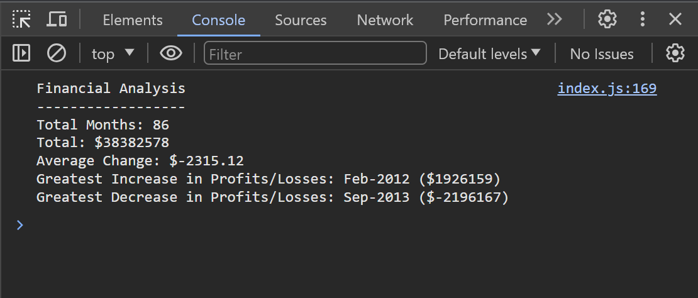

# Console Finances Application

## Description
This project is a console application that processes data of an array. The elements of this array are also arrays, containing monthly periods and the corresponding profits. The application writes the following data to the console:
- The total number of months included in the dataset.
- The net total amount of Profit/Losses over the entire period.
- The average of the changes in Profit/Losses over the entire period.
- The greatest increase in Profit/Losses (date and amount) over the entire period.
- The greatest decrease in Profit/Losses (date and amount) over the entire period.

## Screenshot

## Links
[Link to the deployed application](https://nyitrai87.github.io/console-finances/)

## How to use
In any browser just open the Developer Tools and navigate to the 'Console' tab. E.g. In Google Chrome just right click anywhere on the webpage and choose 'Inspect'.

## Sources
- In the description above I have copied the list from the description of this challenge.